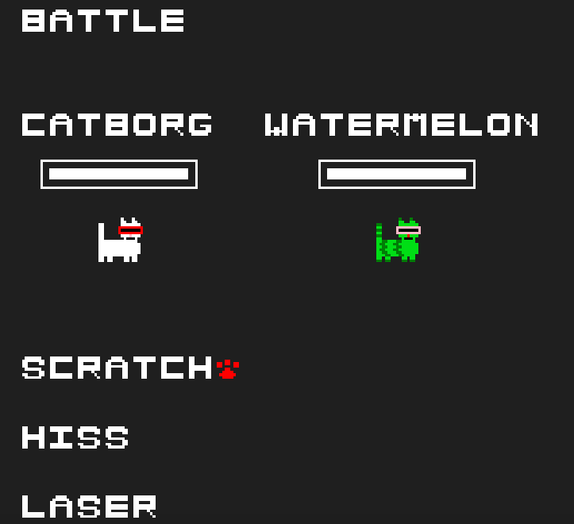
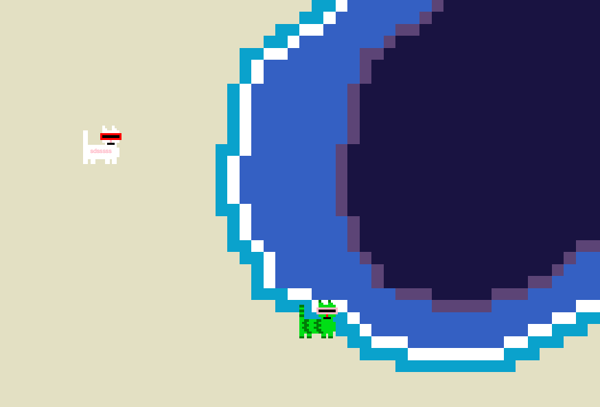

# React Cat Game

A simple React and Typescript game, made using the starter code provided at https://github.com/basarat/react-typescript.git. Nothing too complex, just a basic game that mostly works with some designs I had fun making.





To run, you need Node.js. After which you can go
``` npm install``` once and then to run it, use ```npm start```.

Features:
- An overworld
- A turn-based battle system updating health bars at every turn
- Object collision
- A control I thought was cool: you need to type WASD in the body of CATBORG, which is actually a text box, to get it to move around the map, which renders each pixel as a CSS div.

## What makes this interesting?

I've played with game engines before, and wow using React/Typescript to make a game was a lot harder. It's probably not the right tool for game development.
